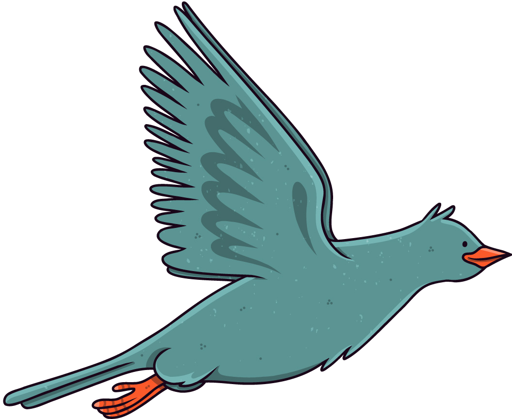
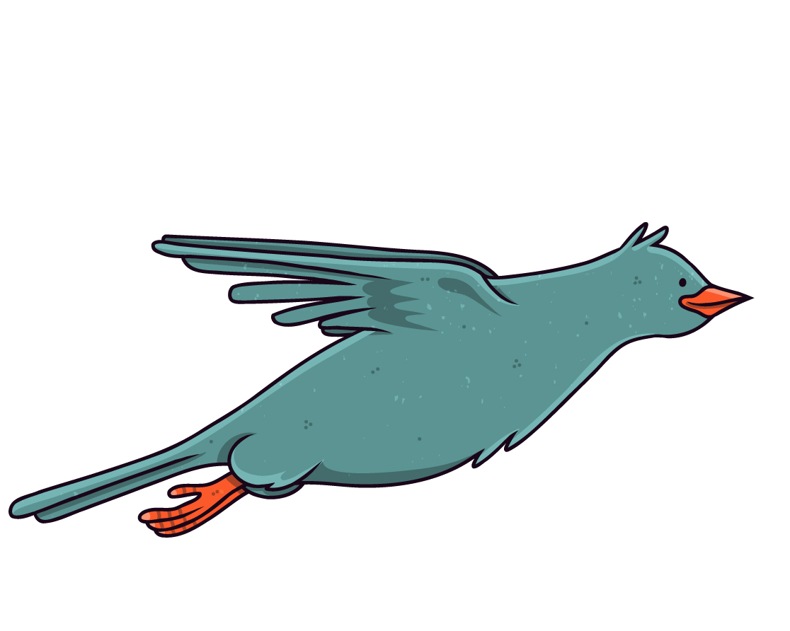
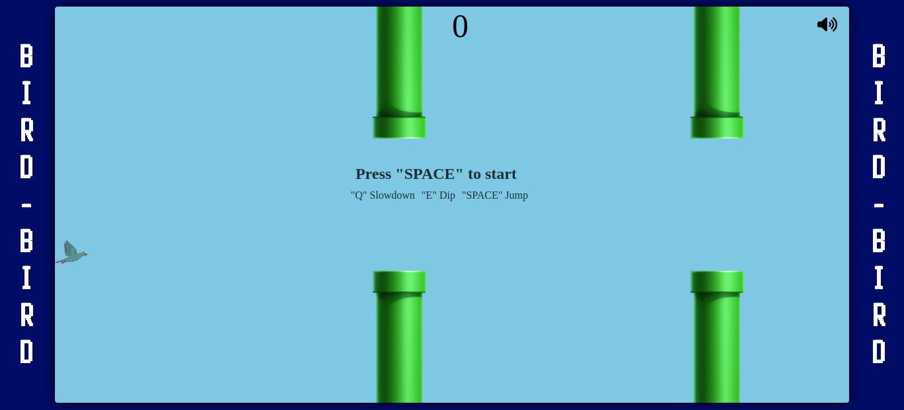

# My GitHub README

Welcome to my README!

## BIRD-BIRD

This is a Desktop-Browser game that was inspired by FlappyBird, but a little more dynamic, with some new mechanics.

### Purpose

Practice and improve proficiency of Pure Javascript, CSS, and HTML.

### How To Play

Fly between the Tunnels.

-  **SPACE**
    The Bird will fly.
    

- **Q** 
    The Bird will Slowdown.
     <!-- Adjust width and height as needed -->

- **E** 
    The Bird will increase the speed of fall and go to front.
     <!-- Adjust width and height as needed -->

Have a Good Game! 
# [PLAY](https://the-bird-orpin.vercel.app/)

<!-- Adjust width and height for gameplay images as needed -->

