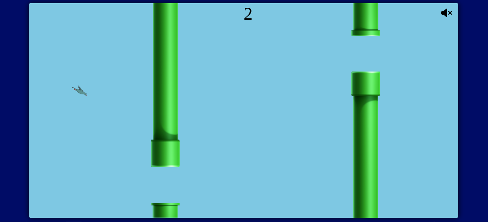

    <h1>BIRD-BIRD<h1>
    
This game was inspired in FlappyBird, but a little more dinamic, with some new mechanics.

    <h2 class="title">Purpose</h2>
    
Practice and improve domain of Pure Javascript, CSS, and HTML.

    <h3 class="title">How To Play</h3>
    
Fly between the Tunnels.

    <ul>
        <li>
            <h4>SPACE<h4>
            

            
The Bird will fly.

            
            

        </li>
        <li>
            <h4>Q<h4>
            

            
The Bird will Slowdown

            
            

        </li>
        <li>
            <h4>E<h4>
            

            
The Bird will increase the speed of fall and go to front.

            
            

        </li>
    </ul>

<h4>Have a Good Game</h4>

    
    
    
    

